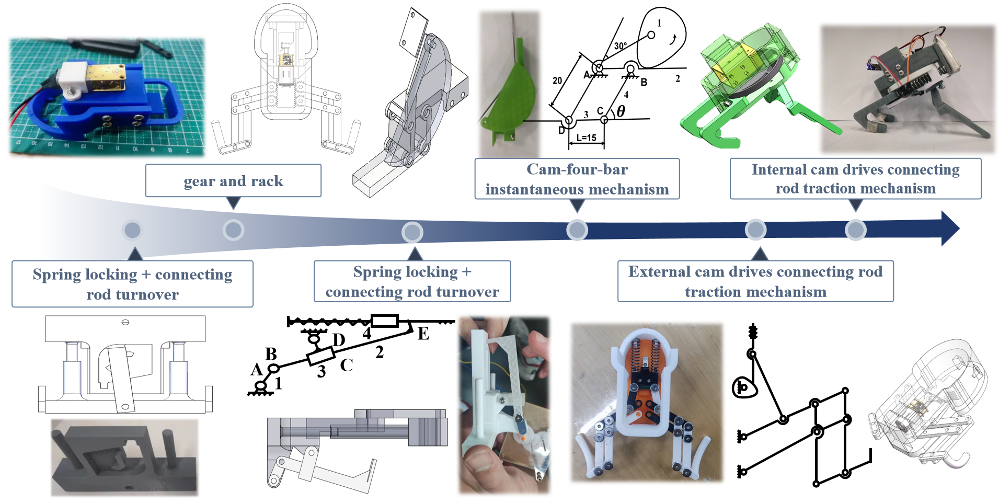
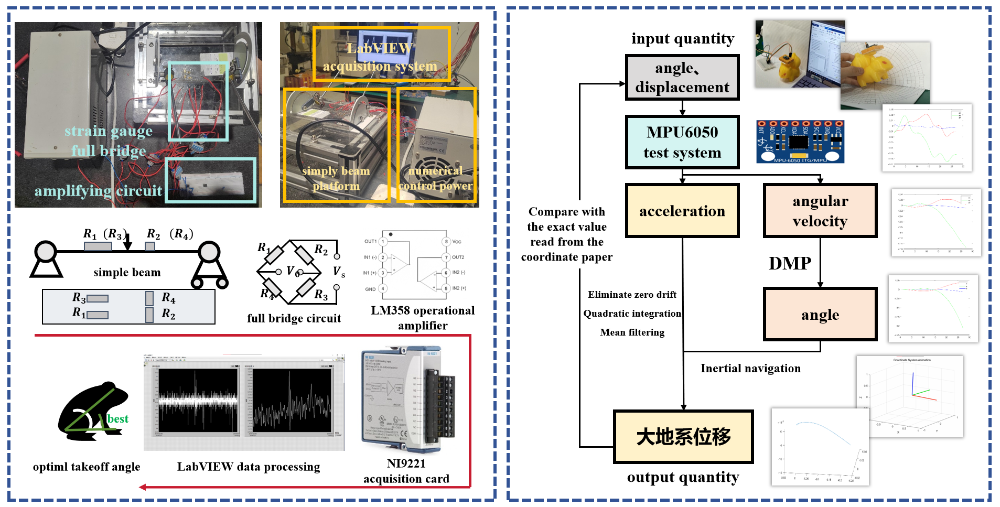

## Abstract

We designed a remotely controlled bionic frog jumping robot. The energy storage mechanism utilizes a cam-driven linkage to compress the spring, and remote control is achieved through Wi-Fi or Bluetooth connections. Within the specified dimensions of the project, it has achieved a jumping distance of greater than 52cm.

## Requirements

This project is targeted at the 11th (2024) National College Students' Mechanical Innovation Design Competition. The bionic frog's appearance has the following size restrictions:

1. Static size does not exceed 0.1m * 0.1m * 0.1m
2. Size after jumping deformation does not exceed 0.2m * 0.1m * 0.1m
3. Total weight does not exceed 4kg
4. Mechanical energy cannot be stored in advance before the competition, and the jump must be completed within 30 seconds.

## Mechanical Design

If a bionic frog needs to complete a jumping action, three key mechanical structures are needed:
1. Driving mechanism
2. Energy storage element
3. Energy locking and release mechanism.

We made many iterations of the mechanical structure of the bionic frog. The final implementation version is: using springs for energy storage, and using internal cams and connecting rods to achieve driving as well as energy locking and release.

## Measure System

To measure the relationship between the frog's takeoff angle and the vertical force exerted on the ground, we have constructed a test platform as shown in the figure. The frog is fixed on the guide rail through a fixing device to achieve a specific takeoff angle. The jumping board is equipped with two transverse and two longitudinal strain gauges. By using a full-bridge circuit of the strain gauges, an external amplifier, and an NI9221 data acquisition card to collect data, filtering is performed in LabView to measure the strain.

## Final Results

Finally, our bionic frog meet the requirements of external dimensions, and it's weight is controlled at 156.3 grams, and the farthest jumping distance > 52 centimeters.

## Publications

- Project Demo Website https://me.sjtu.edu.cn/bkjx/me3220/Projects2024/712.html
