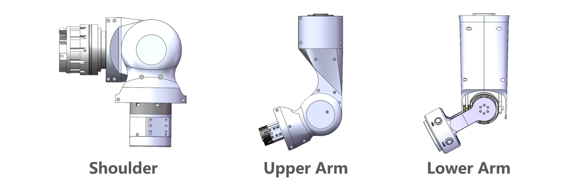
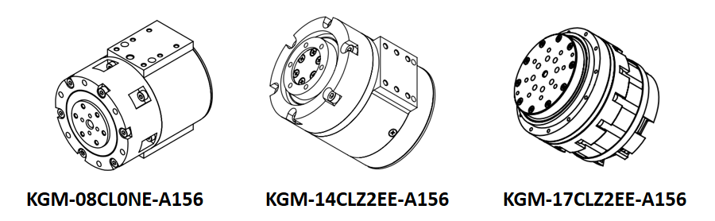
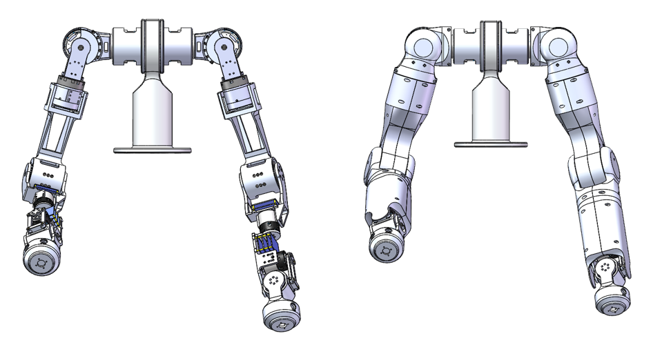

## Abstract

This project was my internship project during 2024 summer at JAKA Robotics. I designed a small 7DOF humanoid robot arm. What sets it apart from most humanoid arms on the market is the configuration of the degrees of freedom at the wrist. The joints use small green harmonic drive reducers.

## Mechanical Design

The humanoid arm can be divided into three parts: the shoulder, the upper arm, and the lower arm. The shoulder has 2 degrees of freedom, the upper arm has 2 degrees of freedom, and the lower arm has 3 degrees of freedom.

## Joint Module

The joint module used green's small harmonic reduction joints.

## Results

## Publications
